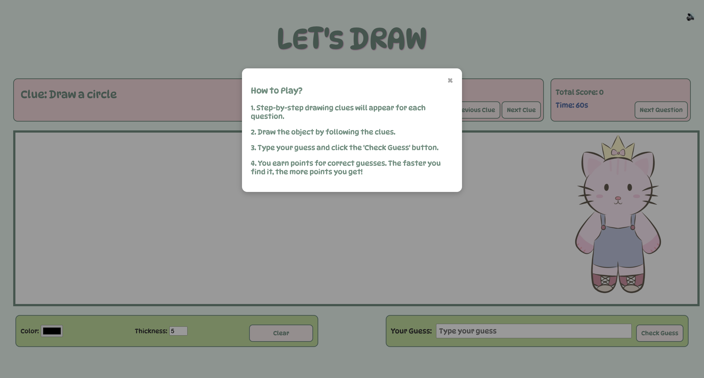
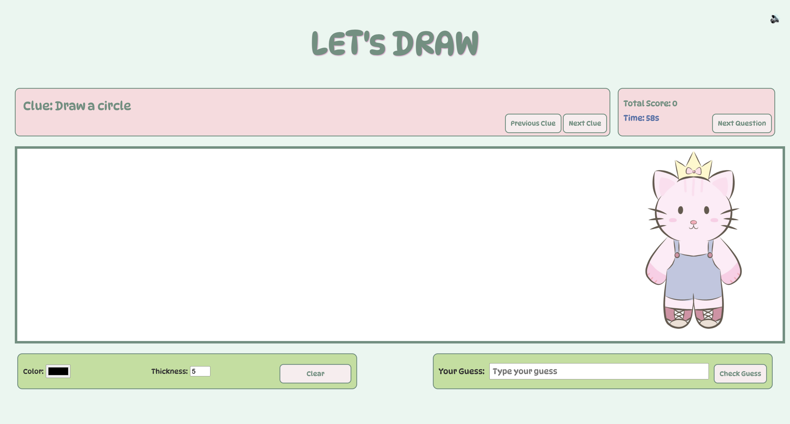

# Web-Based Game Project: Let's Draw

## About the Project

This project is a 2D web-based game developed using HTML5 and JavaScript, inspired by the game [Descriptionary](https://fingerclap.itch.io/descriptionary).  
The core mechanics of the game have been recoded using the canvas element and enriched with my own visual designs.

Descriptionary is a guessing game based on original and creative drawings.

You can play the Let's Draw game [here](https://mlkyzgt.github.io/lets-draw/).

---

## Game Objective and Rules

The player's objective is to draw the correct object based on step-by-step clues and to guess the drawn object.  
The player draws using the mouse, and the drawing time is limited.  
Players make their guesses using the keyboard.  
Points are awarded based on the guessing time and the accuracy of the guess.

---

## Technologies Used

- HTML5 Canvas  
- JavaScript
- CSS
- In-game sound effects and background music

---

## Game Mechanics

- Dynamic drawing tool on Canvas  
- Drawing time and guessing time timers  
- Mouse drawing control  
- Scoring system  
- Simple animations and effects

---

## Screenshots

Below are screenshots from different stages of the game:

### How to Play Page

### Main Menu

### Drawing Example

---

## Important Notes About the Project

- The game has been tested on Chrome, Safari, and Firefox browsers and works flawlessly.  
- No pre-built JS game libraries were used during the development of the game.  
- Links to the images and audio files used can be found here: [background music](https://youtu.be/o5Csf-XrXdY?feature=shared) - [correct/incorrect notification sound](https://www.youtube.com/watch?v=worclOeTALw)
- The code contains explanatory comments in Turkish.  
- A gameplay video has been published on YouTube and can be watched [here](https://youtu.be/kIJhYCGKkXc?si=1VERuQjd7pRqW6Vq).  

---

## Use of Artificial Intelligence

In this project, AI tools (such as ChatGPT) were used to support the game mechanics design and debugging processes.  
All the prompts used and the responses received from the AI are detailed in the "AI.md" file.

---

## Selected Game

- Name: Descriptionary  
- Link: [https://fingerclap.itch.io/descriptionary](https://fingerclap.itch.io/descriptionary)  
- Reason for selection: The game offers a different experience with its original drawing and guessing mechanics, making it an ideal example for applying core mechanics in 2D within the scope of the project.

---

## License and Copyright

- All images used in the project belong to me.  
- License information for external resources I used is specified in the README file.

---

## Other Resources Used

- https://www.w3schools.com
- https://developer.mozilla.org/en-US/docs/Web/CSS/justify-self
- https://developer.mozilla.org/en-US/docs/Web/CSS/flex-direction
- https://css-tricks.com/snippets/css/complete-guide-grid/
- https://codepen.io/javascriptacademy-stash/pen/porpeoJ
- https://medium.com/kodcular/neden-readme-dosyasını-eklemeliyiz-b9dce0adf34c
- https://www.geeksforgeeks.org/how-to-work-with-structs-in-javascript/
- https://www.w3schools.com/howto/howto_js_countdown.asp

---

> *This project was developed for the Web-Based Programming course, and the core mechanics of the Descriptionary game were uniquely implemented using HTML5 canvas.*
